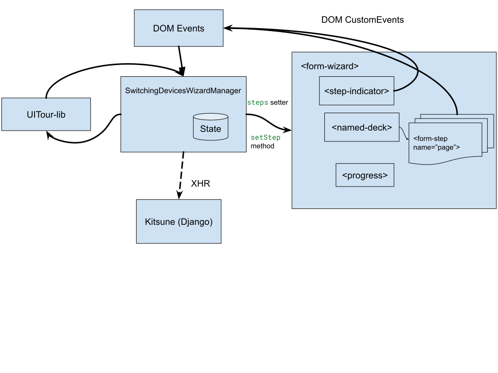
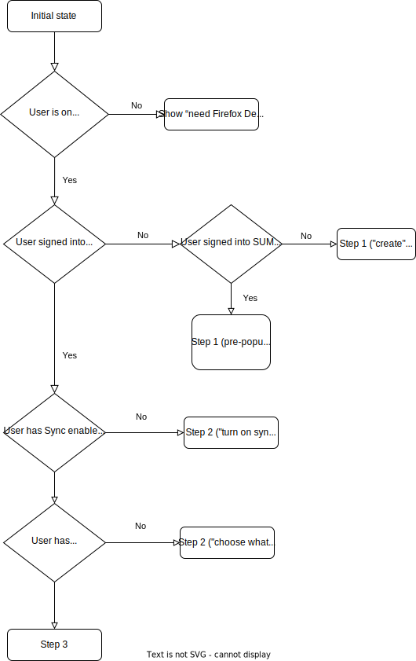

# Switching Devices Guidance

## Introduction

In Q2 of 2023, we introduced a mechanism to make it easier for users to migrate their Firefox data from old devices to new devices. A critical part of this project was a page hosted on Kitsune that walked a user through creating a Firefox Account, making sure syncing was set up, and then giving them the URL to a specially attributed download of Firefox that prioritizes signing in to a Firefox Account during onboarding.

The page doesn't just offer instructions on how to do these things, but instead has an interactive "wizard" that takes the user through each step.

This wizard is a UI component mostly powered by JavaScript in the front-end of Kitsune. The rest of this document details its behaviour and architecture.

## Usage

The wizard requires two things to appear and function properly on a page:

1. To have the page exist in `FIREFOX_SWITCHING_DEVICES_ARTICLES` in `settings.py` in order to get the right scripts loaded for it.
2. To have the special tag `[[UI:device_migration_wizard]]` exist in the markup once (and only once) on the page. At publish-time, this tag is replaced with the markup defined in `hook_device_migration_wizard.html`.

## Architecture

The mechanism for the wizard is broken into two subcomponents - the `SwitchingDevicesWizardManager` JavaScript object and the `<form-wizard>` custom element.

### `<form-wizard>`

The `<form-wizard>` is a customElement that knows how to receive communications from `SwitchingDevicesWizardManager` that describe a step to be on (and what state that step should be in).

Please see the `<form-wizard>` source for the documentation the public mechanisms that are exposed to the `SwitchingDevicesWizardManager`.

The `form-wizard.js` script also exposes a `BaseFormStep` class which needs to be subclassed for each step that is to be represented in the wizard.

### `BaseFormStep`

A step shown in the `<form-wizard>` is represented by a subclass of `BaseFormStep` as a customElement, and then placed within the `<form-wizard>` element as direct descendants in the markup.

Each step must implement the `template` getter, in order to define the HTML markup for the step. It can also optionally override the `render` method in the event that it can be in several states based on the information from `SwitchingDevicesWizardManager`.

See the implementations of [`SignInStep`](https://github.com/mozilla/kitsune/blob/main/kitsune/sumo/static/sumo/js/form-wizard-sign-in-step.js), [`ConfigureStep`](https://github.com/mozilla/kitsune/blob/main/kitsune/sumo/static/sumo/js/form-wizard-configure-step.js) and [`SetupDeviceStep`](https://github.com/mozilla/kitsune/blob/main/kitsune/sumo/static/sumo/js/form-wizard-setup-device-step.js) for examples.

### `SwitchingDevicesWizardManager`

The `SwitchingDevicesWizardManager` is a singleton object whose sole job is to process incoming events or callbacks and reconcile those with the existing internal state to generate a new state. That state is then passed along to the `<form-wizard>` to be seen by the user. The `SwitchingDevicesWizardManager` is effectively a very simple state machine where each state of the machine maps to one of the steps in the `<form-wizard>`.

This is a diagram of the state machine logic:

The `<form-wizard>` is expected to exist in the DOM by the time that the `SwitchingDevicesWizardManager` initializes. Page script will be expected to constructed the `SwitchingDevicesWizardManager` with a reference to the `<form-wizard>`.

The `SwitchingDevicesWizardManager` is also responsible for performing any special network or `UITour` requests to get additional data to help compute which step the user is on. Once it has computed the step, it calls the `setStep` method on the `<form-wizard>` to present that step to the user.
